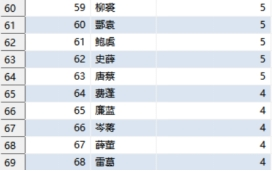

**详细报告见：**[PDF](https://github.com/HT-hlf/ht_sql_smt_demo/blob/master/report.pdf)

# 课程作业题目

某电子企业建有若干SMT产线（SMTLine_01, SMTLine_02,......）,可批量生产多种型号的主板（PCB_AA, PCB_AB,......）。企业以派工单的形式安排生产，一款主板可能对应多个派工单，派工单包含主板型号、计划数量、计划开工时间、计划完工时间等信息，一个派工单仅安排给一条生产线，一条产线可接收多个派工单。派工单执行后，产生实际开工时间、实际完工时间，实际完工数量，合格数量，不合格数量等......。

(1) 根据自己对题意的理解建立一个小型生产管理数据库的概念模型。

(2) 写出数据库的关系模式（主码相同的关系模式尽可能合并）。

(3) 设计6~10个有意义的数据查询或更新，给出对应SQL语句。

# 作业完成环境和内容

## 作业完成环境

由于Microsoft SQL Server 在自己电脑上（Windows / Linux系统）都无法配置，所以本作业使用 ***\*MySQL\**** 作为数据库管理系统进行数据库开发，MySQL是一个开源的关系型数据库管理系统，由瑞典MySQL AB公司1995年开发，是目前最流行的开源关系型数据库管理系统。***\*MySQL和的Microsoft SQL Server语法基本一致，仅有部分功能关键词不同\****。并且我们使用***\*Python语言+SQL语句\****的方式进行数据库更新和查询等操作。使用***\*DBeaver\****软件进行数据库基本表和视图的可视化。

## 作业完成内容

本次课程作业建立了各实体的E-R图及整个SMT产线数据库的概念模型，然后建立了SMT产线数据库的关系模式，再使用Python语言+SQL语句对数据库基本表进行批量的数据写入，最后编写了各种有意义的数据查询和计算，建立了对应视图，在DBeaver软件对基本表、视图、查询结果进行了可视化。本次作业的所有代码和建立的数据库都已开源。

***开源链接：***https://github.com/HT-hlf/ht_sql_smt_demo.git\](https://github.com/HT-hlf/ht_sql_smt_demo.git)

 

 

 

 

 

 

 

 

# SMT产线数据库概念模型

## 实体的E-R图

(1) 主板实体的E-R图

###  

(2) SMT产线实体的E-R图

 

运行状态是由生产线设备自动上传到数据库的，有两种情况：生产，故障。需要说明的是运行状态是实时更新的。（正常情况下生产线设备应包括闲置状态，但是如果这样设定的话，后面随机生成数据，容易与派工单的时间相冲突，因为理论上从派工单中也可以计算出闲置的派工单。）

 

(3) 员工实体的E-R图

 

 

工种其实在维修单和派工单可以查询到，但是不排除新员工在刚开始没有任何维修单和派工单的情况。同时考虑到工种的储存并不占很大空间，将员工工种分为维修和生产两大类存储在员工基本表中。

 

(4) 维修单实体的E-R图

 

 

 

(5) 派工单实体的E-R图

 

 

 

 

## SMT产线数据库的E-R图

 

 

 

 

# SMT产线数据库关系模式

 

***\*候选键\****

***\*外键\****  

***\*SMT\****产线（产线编号, 运行状态）

***\*派工单\****（***\*派工单编号\****, 计划开工时间, 计划完工时间, 实际开工时间, 实际完工时间, 实际完工数量, 合格数量, 计划数量, ***\*生产工工号\****, ***\*生产线编号\****, ***\*主板型号\****）

***\*主板\****（***\*型号\****, 成本, 售价）

***\*员工\****（***\*工号\****, 姓名, 性别, 出生日期, 工种）

***\*维修单\****（***\*维修单编号\****,维修开始时间,维修结束时间,***\*维修工工号\****,***\*维修生产线编号\****）

 

***\*SMT_U_Line\**** (***\*U_Line_Number\****, U_Line_Operation_Status )

***\*Dispatch_Order\**** (***\*Dispatch_Order_Number\****, Work_Plan_Start_Time, Work_Plan_End_Time, Work_Real_Start_Time, Work_Real_End_Time, Work_Real_Sum_Number, Work_Real_Qualified_Number, Work_Plan_Number, ***\*Staff_Number, U_Line_Number\****, ***\*Mainboard_Number\**** )

***\*Mainboard\**** (***\*Mainboard_Number\****, Mainboard_Cost, Mainboard_Sale_Price )

***\*Staff\**** (Staff_Number, Staff_Name, Staff_Sex, Staff_Birth, Staff_Work_Type )

***\*Repair_Order\**** (***\*Repair_Order_Number\****, Repair_Start_Time, Repair_End_Time, ***\*Staff_Number\****, ***\*U_Line_Number\**** )

 

# SMT产线数据库数据查询与更新

数据库的基本表及数据查询与更新所产生的各种视图如下图所示。下文将列出各种查询更新语句及其查询结果。

 

 

## 基本表的创建和数据的更新写入

为了验证查询和更新的语句语法及结果的正确性，我通过在Python语言里使用SQL插入语句随机批量生成了一批数据，这批数据可能并不那么真实，但是逻辑上是没有问题的，例如计划完工时间应晚于计划开工时间，实际完工数量大于合格数量等，因此可以用于验证查询和更新结果。

 

**l** ***\*创建员工基本表\****

 

 

**l** ***\*创建主板基本表\****

 

**l** ***\*创建生产线基本表\****

 

**l** ***\*创建维修单基本表\****

 

**l** ***\*创建派工单基本表\****

 

**l** ***\*向生产线基本表写入数据\****

 

**值得说明****的是%s是正****则表达式，方便在程序中批量生成数据****。**

**n** ***\*生产线基本表展示\****

总共生成了99条生产线，这里仅展示前10条。

 

 

**l** ***\*向员工基本表写入数据\****

 

**n** ***\*员工基本表展示\****

总共生成了109个员工，这里仅展示前10个。

 

 

**l** ***\*向主板基本表写入数据\****

 

**n** ***\*主板基本表展示\****

总共生成了26个主板，这里仅展示前10个。

 

 

**l** ***\*向派工单基本表写入数据\****

考虑到正在执行的派工单没有实际完成时间，所以将其实际完成时间设置为2000-01-01 01:00:00（一个不可能产生冲突的时间）。

 

**n** ***\*派工单基本表展示\****

总共生成了600个派工单，这里仅展示前50个。

 

 

 

 

**l** ***\*向维修单基本表写入数据\****

考虑到正在执行的维修单没有维修完成时间，所以将其维修完成时间设置为2000-01-01 01:00:00（一个不可能产生冲突的时间）。

 

**n** ***\*维修单基本表展示\****

总共生成了50个维修单，这里仅展示前20个。

 

## 查询员工的“绩效”

**l** ***\*查询维修员工的已完成维修次数\****

 

**n** ***\*查询结果展示\****

 

**l** ***\*查询生产员工的已完成派工单数\****

 

**n** ***\*查询结果展示\****

查询到了100个生产员工的已完成派工单数，这里仅展示部分查询结果（后面同样仅展示部分查询、计算结果）。

 

 

## 查询、计算各个主板的生产和营收情况

**l** ***\*查询、计算各个主板的总实际产量、总合格产量、总计划产量、合格率、生产完成率、总生产利润\****

 

**n** ***\*查询结果展示\****

 

## 查询、计算正在生产的派工单和正在维修的维修单

**l** ***\*查询、计算正在生产的派工单、及其生产进度、生产员工、生产线和生产线的状态\****

 

**n** ***\*查询结果展示\****

 

**l** ***\*查询正在维修的维修单及其维修员工姓名\****

 

**n** ***\*查询结果展示\****

 

## 查询、计算生产线总的生产情况和维修情况

**l** ***\*查询、计算生产线总的生产情况\****

 

**n** ***\*查询结果展示\****

 

**l** ***\*查询、计算生产线总的维修情况\****

 

**n** ***\*查询结果展示\****

 

## 查询本周生日的员工及工厂员工的平均年龄

**l** ***\*创建判断是否是本周生日的函数\****

 

***\**MySQL\**\******\**用now\**\******\**()\**\*** ***\**来获取当前时间\**\******\**相比于 getdate()\**\***

**l** ***\*查询本周生日的员工\****

 

**n** ***\*查询结果展示\****

2022年12月7日查询结果：

 

**l** ***\*查询工厂的员工平均年龄\****

 

***\**MySQL\**\******\**用now\**\******\**()\**\*** ***\**来获取当前时间\**\******\**相比于 getdate()\**\***

**n** ***\*查询结果展示\****

 

## 查询合格率大于96%的生产线

**l** ***\*查询合格率大于96%的生产线\****

 

**n** ***\*查询结果展示\****

 